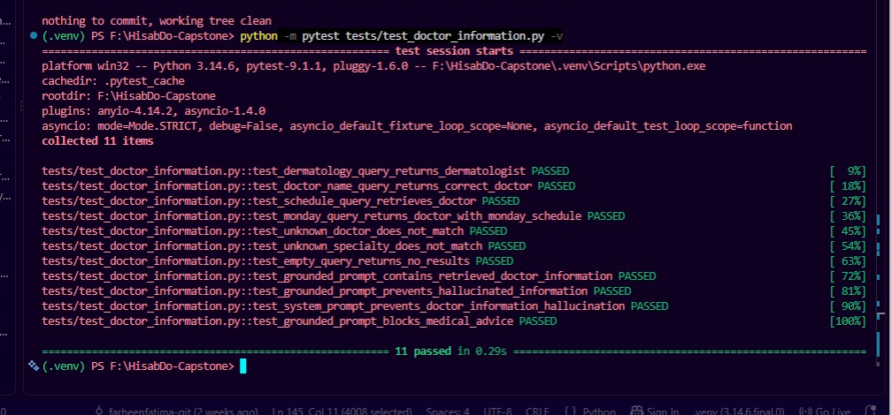
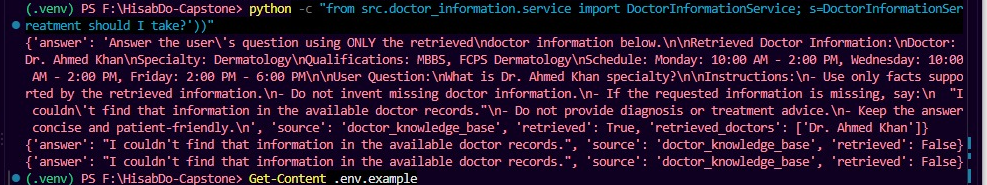
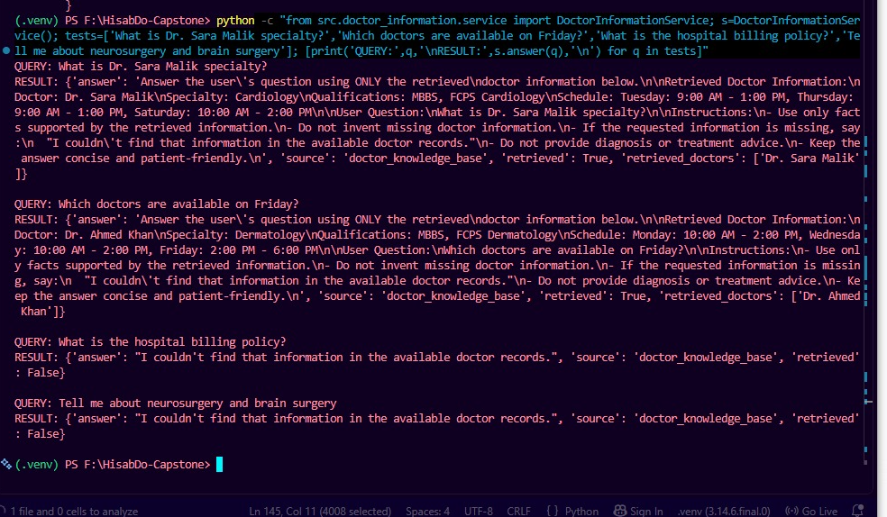

# PR #95 — Doctor Information Assistant QA Evidence

## PR Details

- PR: #95 — Task-sept7-doctor-info-assistant-farheenfatima
- Author: Farheen Fatima
- QA Date: September 12, 2026
- QA Branch: `feature/sprint1-ai-qa-isma`
- Repository under review: `usmankhalid172/hisabdo-webapp-ai`

## Automated Tests

Command:

`python -m pytest tests/test_doctor_information.py -v`

Result:

**11 passed in 0.29s**

| Test Area | Result |
|---|---|
| Dermatology retrieval | PASS |
| Doctor-name retrieval | PASS |
| Schedule retrieval | PASS |
| Monday schedule retrieval | PASS |
| Unknown doctor rejection | PASS |
| Unknown specialty rejection | PASS |
| Empty-query handling | PASS |
| Grounded prompt content | PASS |
| Hallucination-prevention prompt | PASS |
| System prompt safety instructions | PASS |
| Medical-advice prompt instruction | PASS |

## Additional QA Checks

| Check | Result |
|---|---|
| Dr. Sara Malik specialty retrieval | PASS |
| Friday doctor availability retrieval | PASS |
| Unrelated hospital billing query rejected | PASS |
| Neurosurgery/brain surgery query rejected | PASS |

## Integration Audit Findings

### 1. No FastAPI endpoint exposed

The PR adds the `doctor_information` service, retriever, prompts, and knowledge base, but no router/API endpoint was added.

`src/main.py` also contains no registration for the doctor-information feature.

Therefore, the feature cannot currently be tested through an HTTP API boundary for .NET backend integration.

### 2. No Pydantic request/response contract

`DoctorInformationService.answer()` returns a plain Python `Dict` containing:

- `answer`
- `source`
- `retrieved`
- `retrieved_doctors`

No dedicated Pydantic request/response models are defined for this feature.

This leaves the .NET-facing JSON contract unspecified.

### 3. No actual LLM response generation

The service explicitly returns a grounded prompt for downstream LLM integration.

The `answer` field therefore contains the prompt/instructions rather than a generated natural-language doctor-information answer.

This is acceptable as a retrieval/prompt POC only, but it is not a complete AI API integration.

### 4. Medical-advice protection is prompt-level only

The PR includes instructions such as:

`Do not provide diagnosis or treatment advice.`

However, the service does not call an LLM or enforce this rule at an API/service boundary. The automated test verifies that the instruction exists in the prompt; it does not verify actual model behavior.

### 5. Shared .env configuration drift

PR #95 keeps the common service identity and internal token configuration, but its `.env.example` removes existing variables:

- `ANTHROPIC_API_KEY`
- `OPENAI_API_KEY`
- `CATEGORIZATION_CONFIDENCE_THRESHOLD`

It introduces:

- `LLM_API_URL`
- `LLM_API_KEY`
- `VECTOR_STORE_URL`
- `VECTOR_STORE_INDEX`
- `VECTOR_STORE_API_KEY`
- doctor-specific retrieval settings

This should be reconciled with the shared AI-service configuration contract before integration.

## Final QA Verdict

**REQUEST CHANGES — Integration Contract Incomplete**

The doctor-information retrieval component itself passed all automated tests and additional negative-query checks. However, the PR does not yet provide the HTTP/API request-response contract required for independent .NET backend integration.

The feature should be considered a **retrieval + grounded-prompt POC**, not a complete integrated AI API feature.

## Evidence Summary

- Automated tests: **11/11 passed**
- Additional retrieval/negative-query checks: **4/4 passed**
- HTTP API endpoint: **Not implemented**
- Pydantic integration schema: **Not implemented**
- Actual LLM generation: **Not implemented**
- .NET-facing JSON contract: **Not defined**
- Configuration alignment: **Requires reconciliation**
- Final verdict: **REQUEST CHANGES**

## Evidence Screenshots

### 1. Automated Tests — 11/11 Passed

### 2. Doctor Information Retrieval

### 3. Negative / Irrelevant Query Checks

